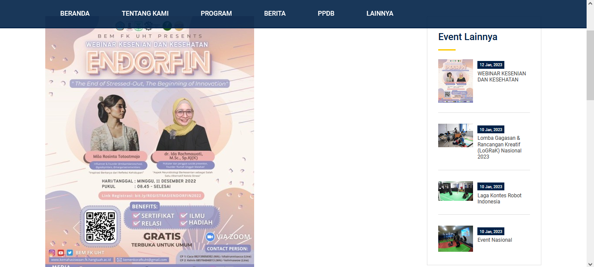

## Tentang Politeknik Ku

Sekolahku adalah aplikasi manajemen sekolah berbasis website yang di bangun dan di kembangkan dengan Framework Laravel. Fitur-fitur pada aplikasi Politeknik Ku antara lain :

-   Website Sekolah (Done)
-   PPDB (Done)
-   Perpustakaan (Done)
-   Sistem Pembayaran Sekolah SPP (Done)
-   Alumni

## Installation

-   Install [Composer](https://getcomposer.org/download) and [Npm](https://nodejs.org/en/download)
-   Clone the repository: `git clone https://github.com/Arfiyan19/Politeknik-Ku.git`
-   Install dependencies: `composer install ; npm install ; npm run dev`
-   Run `cp .env.example .env` for create .env file
-   Run `php artisan migrate --seed` for migration database
-   Run `php artisan storage:link` for create folder storage

## Penggunaan

-   DB Saya Sertakan dengan Nama db_sekolahku.sql
-   Login sebagai Admin email: admin@gmail.com & pw: Bismillah
-   Login sebagai PPDB, Perpustakaan, Staf, Pengajar semua dengan password 12345678

Note : Aplikasi ini akan terus saya update. 
Jika ada pertanyaan bisa kontak aku di email ini <b>arfieyan1903@gmail.com</b>

## Tampilan

Tampilan Home User

Halaman Profil Sekolah
  

Halaman Program Studi
  
Halaman Kegiatan
  
Halaman Berita
  
Halaman PPDB
  
Halaman Event
  

Halaman LOGIN
  

Halaman ADMIN DASHBOARD
  

Halaman ADMIN PROGRAM STUDI
  

Halaman ADMIN TAMBAH PROGRAM STUDI
  

Halaman ADMIN KEGIATAN
  

Halaman ADMIN IMAGE SLIDER
  

Halaman ADMIN BERITA
  

Halaman ADMIN PENGAJAR
  

Halaman ADMIN PPDB
  
